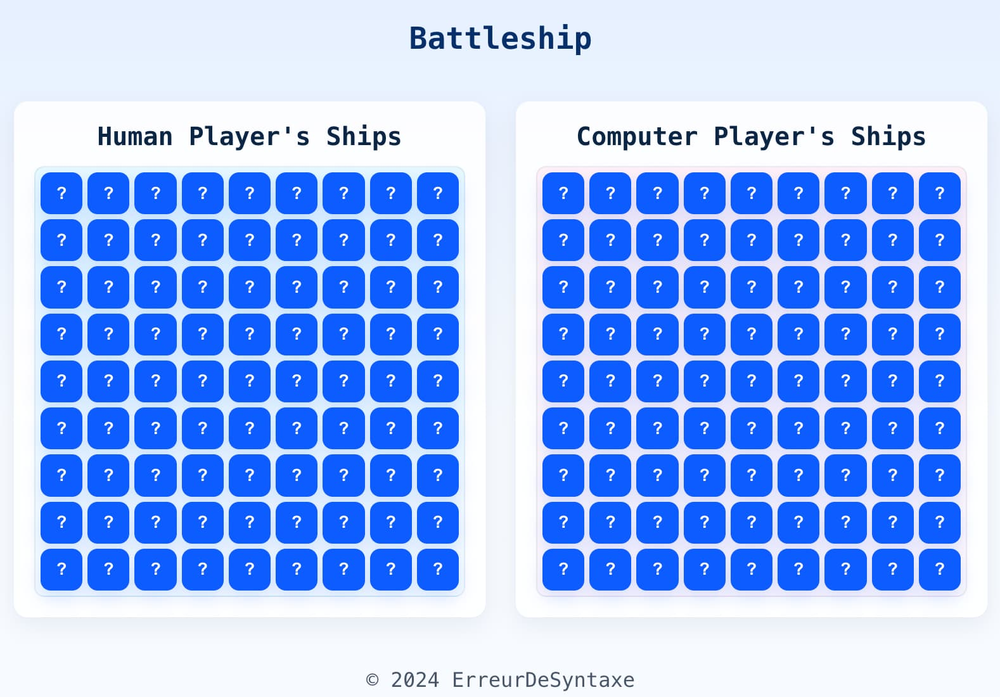

# 🧩 Battleship

An browser console implementation of Battleship built through the TDD approach.

---

## 📖 About the Project

### 🖼️ Preview

<div align='center'>
  
</div>

### 🌐 Live Demo

[Visit Project](http://google.com/)

### 🎯 Objective

This project’s goal is to **learn TDD by building a game**.

### ✨ Notable Features

- Console playable
- Play against the computer
- Launch a new game when the game is over

### 🧱 Built With

<p align="left">
  
  
  
</p>

---

## ⚙️ Development

This section serves as both a checklist and roadmap.

### 🗒️ To-Do Overview

#### 🧾 Documentation

- [x] Rewrite this README
  - [x] Title
  - [x] Description
  - [x] Objective
  - [x] Notable Features

#### 🧠 Planning

- [x] User stories
- [x] Features
- [x] Flowchart
- [x] Architecture
<!-- - [ ] UI Design / Sketch -->

#### 💻 Development Steps

<!-- - [ ] **Basic HTML**
  - [ ] Title & Meta
  - [ ] Structure
  - [ ] Favicons -->

- [ ] **Vitest Setup**
  - [ ] Install Vitest (`npm i vitest -D`)
  - [ ] Add `"test": "vitest --run --reporter verbose"` and `"test:watch": "vitest"` scripts
- [ ] **Logic & UI**
  - [ ] Console-based logic
  - [ ] Refined UI & layout
  - [ ] Menu / Navigation

  <!-- - [ ] **Responsive Design**
  - [ ] Responsive images (Art direction)
  - [ ] Media queries
  - [ ] Mobile menu -->
  <!-- - [ ] **Accessibility & Optimization**
  - [ ] Check accessibility
  - [ ] Optimize images
  - [ ] Run Lighthouse -->

#### 🚀 Deployment (Git + GitHub Pages)

- [ ] `npm install --save-dev gh-pages`
- [ ] Add `"homepage": "https://erreurdesyntaxe.github.io/<repo>/"`
- [ ] Add `"deploy": "gh-pages -d dist"`
- [ ] `npm run build`
- [ ] Commit all changes on main
- [ ] `npm run deploy`

#### 🪞 Final Review

- [ ] Update Live Page Link
- [ ] Update Project Preview Image
- [ ] Confirm Built With section
- [ ] Add Reflection
- [ ] Remove User Stories
- [ ] Remove Flowchart
- [ ] Remove Development

---

## 👥 User Stories

- As a user, I want my ships to be placed randomly
- As a user, I want to enter (x, y) coordinates to attack
- As a user, I want to know if my attack hit or missed
- As a user, I want to see previous hits and misses in a visual format
- As a user, I want to know when the computer hits my own ships
- As a user, I want to know when either player's ships are hit/sunk
- As a user, I want to know when the game ends
- As a user, I want to launch a new game when the game ends

---

## 🧩 Features

- Users can launch a game
- Users can enter the coordinates they wish to attack
- Users get feedback on their attack
- Users can see the results of all previous attacks
- Users win when all enemy ships have been sunk
- Users lose when all their ships have been sunk
- Users can launch a new game when one ends

---

## 🧭 Flowchart

Page loads → User opens console → User starts game
→ Ships are placed randomly for each player → User plays → Hits/Misses are recored
→ Player/Computer loses → App offers rematch → User starts game...

---

## 🏗️ Architecture

```js
class App {
  constructor(players = [], board) {
    this.players = players;
    this.board = board;
  }

  run() {
    console.log('Starting App...\n');
  }
}

class Player {
  constructor(type = 'player', board) {
    this.type = type;
    this.board = board;
  }
}

class Gameboard {
  constructor(size = 8, ships = [], attacks = []) {
    this.size = size;
    this.ships = ships;
  }

  receiveAttack(x, y) {}
  checkAllSunk() {}
}

class Ship {
  constructor(shipName, shipLenght, currentHits, isSunk) {
    this.shipName = shipName;
    this.shipLength = shipLength;
    this.currentHits = currentHits;
    this.isSunk = isSunk;
  }

  hit() {}
  checkIsSunk() {}
}
```
